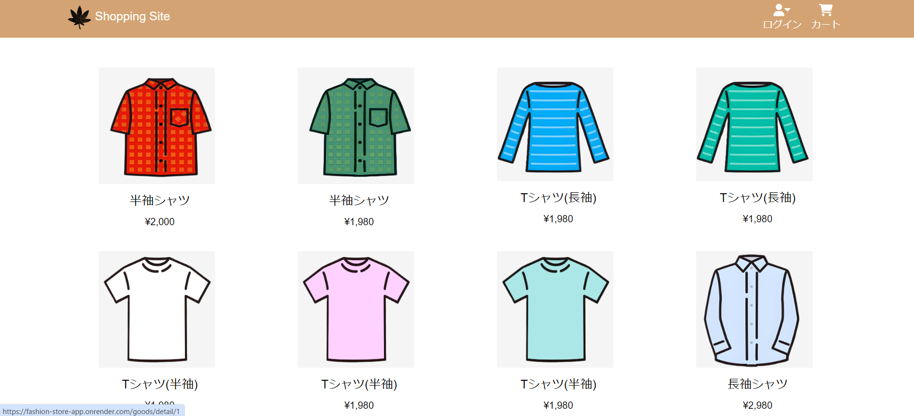
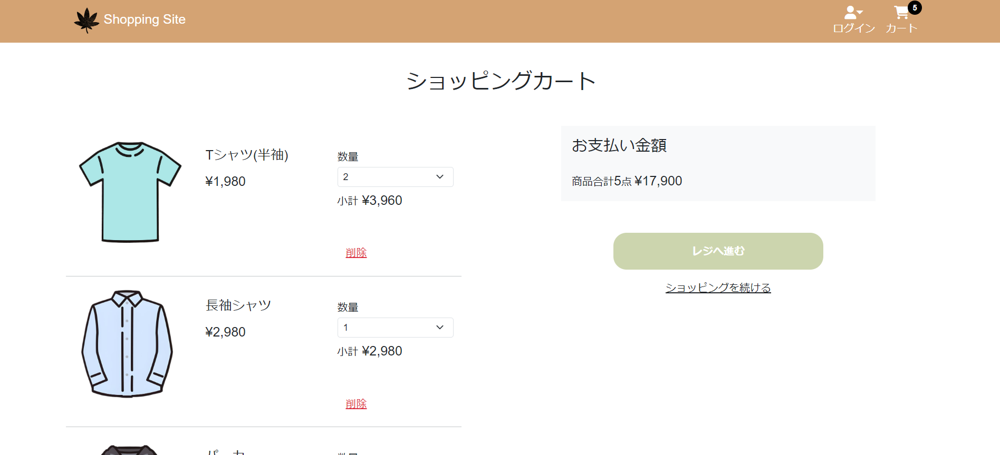

# Fashion Store

## 概要
このプロジェクトは、完全なECサイトのプロトタイプです。 ユーザーは商品を閲覧し、カートに追加し、購入手続きを行うことができます。

## デモ

## スクリーンショット

  
<strong>ホームページ</strong>

  

 

  
<strong>商品詳細</strong>

  

 

  
<strong>カート</strong>

  

## 機能
- 商品閲覧と検索
- 商品の詳細ページ
- カート機能
- ユーザー認証とアカウント管理
- 注文履歴の閲覧
- ⚙管理者用ダッシュボード（商品の管理、注文管理）

## 技術スタック
### フロントエンド

### バックエンド

### データベース

### インフラ

### その他

## 使用方法
- **ユーザー**: ユーザーは、ホームページから商品を閲覧し、カートに追加、注文を完了できます。
- **管理者**: 管理者は、`/admin` URLからダッシュボードにアクセスし、商品や注文を管理できます。

## デプロイ
- **本番環境へのデプロイ手順**: Renderを使用してデプロイしました。無料枠でデプロイするため、Spring Bootに内包されているH2データベースを使用しました。
